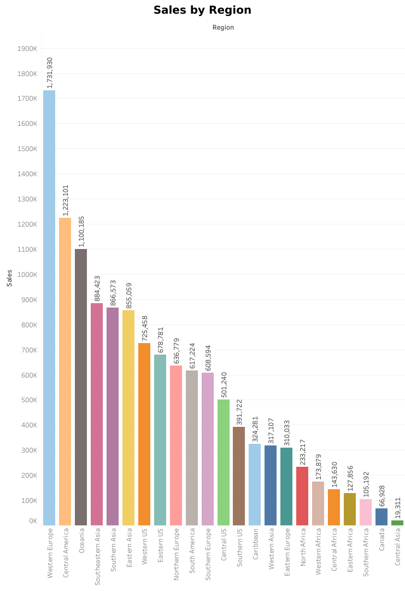
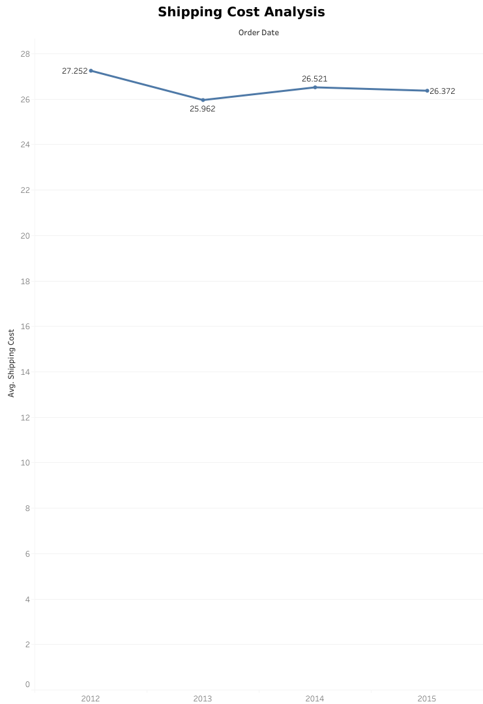
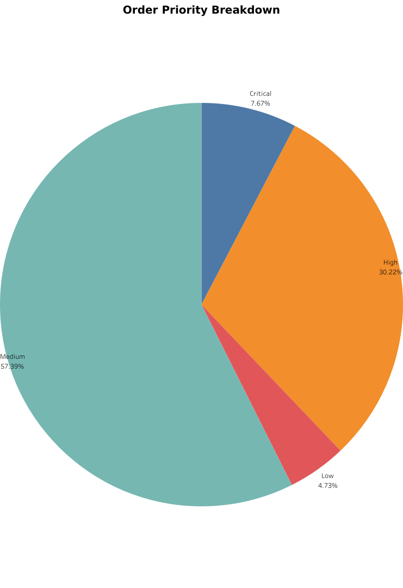
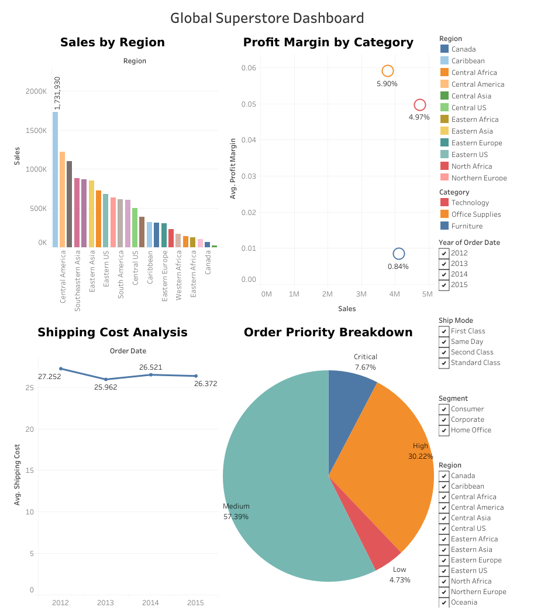

# 📊 Global Superstore Interactive Dashboard <a href="https://www.tableau.com/" target="_blank" rel="noreferrer"> **Tableau** </a>

<a href="placeholder_link_to_dashboard.pdf" target="_blank" rel="noreferrer"></a> [Global Superstore Dashboard](https://public.tableau.com/app/profile/tunjis/viz/20250311GlobalSuperstoreDashboard/GlobalSuperstoreDashboard) |  [Data Source](https://justit831-my.sharepoint.com/:x:/g/personal/justincracium_bootcamp_justit_co_uk/EYurcEVzHfNKuJMekvc9dUoBXt0RLloYd8P0sEndcW8iPA?e=7PJRBV)</a> | <a href="placeholder_link_to_task_doc.docx" target="_blank" rel="noreferrer">
 [Task Brief](https://justit831-my.sharepoint.com/:w:/g/personal/justincracium_bootcamp_justit_co_uk/ESUi6rZy0_dHkbV_O2zgxPcBMIC3w24U8nx3-efskB4jFA?e=2794eb)</a>  

**Objective:** To analyse the Global Superstore dataset and develop an interactive dashboard showcasing key business metrics, demonstrating proficiency in data connection, visualisation creation, and dashboard design within Tableau.

**Key Activities & Skills Demonstrated:**

* **Data Connection & Preparation:** Connected to the `global_superstore_2016` dataset; Verified and adjusted **`Data Types`** as needed.
* **Core Visualisations:**
    * **`Bar Chart`**: Created 'Sales by Region', **`Sorted`** regions by total sales (descending), and implemented a **`Filter`** for `Year`. ([View Bar Chart](https://public.tableau.com/views/20250311GlobalSuperstoreDashboard/SalesbyRegion?:language=en-GB&:sid=&:redirect=auth&:display_count=n&:origin=viz_share_link))
    * **`Scatter Plot`**: Developed 'Profit Margin by Category', plotting `Profit` vs. `Sales`, using **`Colour Encoding`** to distinguish `Product Category`. ([View Scatter Plot](https://public.tableau.com/views/20250311GlobalSuperstoreDashboard/ProfitMarginbyCategory?:language=en-GB&:sid=&:redirect=auth&:display_count=n&:origin=viz_share_link))
    * **`Line Chart`**: Built 'Shipping Cost Analysis', showing `Average Shipping Cost` over `Time` (Order Date), with **`Filters`** for `Ship Mode`. ([View Line Chart](https://public.tableau.com/views/20250311GlobalSuperstoreDashboard/ShippingCostAnalysis?:language=en-GB&:sid=&:redirect=auth&:display_count=n&:origin=viz_share_link))
    * **`Pie Chart`**: Designed 'Order Priority Breakdown', displaying the distribution using a **`Table Calculation`** (`Percentage of Total`), with **`Filters`** for `Segment` and `Region`. ([View Pie Chart](https://public.tableau.com/views/20250311GlobalSuperstoreDashboard/OrderPriorityBreakdown?:language=en-GB&:sid=&:redirect=auth&:display_count=n&:origin=viz_share_link))
* **Calculated Fields & Analytics:** Implicitly used aggregate functions (e.g., **`SUM`**, **`AVG`**) for visualisations; Applied **`Table Calculations`** (`Percent of Total`).
* **Dashboard Design & Interactivity:** Combined the four worksheets into a single **`Dashboard`**; Configured **`Filter Actions`** to link filters across visuals, ensuring a cohesive and user-friendly experience.
* **Formatting & Presentation:** Applied consistent **`Formatting`**, clear titles, and legends for a visually appealing and interpretable dashboard.

---

### Summary of Key Tableau Skills Demonstrated:

* **Data Handling:** Connecting to data sources, Data Type management.
* **Visualisation:** Creating various chart types (`Bar`, `Scatter`, `Line`, `Pie`), Sorting, Colour Encoding.
* **Analytics:** Aggregate functions, Table Calculations (`Percent of Total`).
* **Interactivity:** `Filters`, `Filter Actions`.
* **Dashboarding:** Combining worksheets, Layout design, Formatting.

```
## 📊 Example Output






```

### 🧑‍💻 Created by [tunjis](https://github.com/tunjis) 

-------------

* 🌍  Based in <a href="https://maps.app.goo.gl/hMxhRX5ptQAAkL7NA/" target="_blank">**London**</a>
* 🖥️  See my portfolio at [Data’s the new oil. I’m the refinery.](https://github.com/tunjis?tab=repositories)
* 📫  Contact me via my [LinkedIn profile](https://linkedin.com/in/justincraciun/)
* 🧠  Learning Data Science
* 🤝  Open to collaborating on interesting projects
* ⚡  AI enthusiast

-------------

### 🛠️ Technical Skills
<a href="https://www.python.org/" target="_blank" rel="noreferrer"> **Python** </a>&nbsp;
<a href="https://www.microsoft.com/en-us/microsoft-365/excel" target="_blank" rel="noreferrer"> **Microsoft Excel** </a>&nbsp;
<a href="https://www.mysql.com/" target="_blank" rel="noreferrer"> **MySQL** </a>&nbsp;
<a href="https://www.tableau.com/" target="_blank" rel="noreferrer"> **Tableau** </a>&nbsp;
<a href="https://powerbi.microsoft.com/" target="_blank" rel="noreferrer"> **Power BI** </a>&nbsp;  

<a href="https://azure.microsoft.com/" target="_blank" rel="noreferrer"> **Microsoft Azure** </a>&nbsp;
<a href="https://cloud.google.com/" target="_blank" rel="noreferrer"> **Google Cloud** </a>&nbsp;
<a href="https://colab.research.google.com/" target="_blank" rel="noreferrer"> **Google Colab** </a>&nbsp;&nbsp;  

-------------

### 🔁 Socials

<a href="https://www.github.com/tunjis/" target="_blank" rel="noreferrer">
  <picture>
    <source media="(prefers-color-scheme: dark)" srcset="https://raw.githubusercontent.com/danielcranney/readme-generator/main/public/icons/socials/github-dark.svg" />
    <source media="(prefers-color-scheme: light)" srcset="https://raw.githubusercontent.com/danielcranney/readme-generator/main/public/icons/socials/github.svg" />
    
  </picture>
</a>&nbsp;
<a href="https://linkedin.com/in/justincraciun/" target="_blank" rel="noreferrer">
  <picture>
    <source media="(prefers-color-scheme: dark)" srcset="https://raw.githubusercontent.com/danielcranney/readme-generator/main/public/icons/socials/linkedin-dark.svg" />
    <source media="(prefers-color-scheme: light)" srcset="https://raw.githubusercontent.com/danielcranney/readme-generator/main/public/icons/socials/linkedin.svg" />
    
  </picture>
</a>&nbsp;&nbsp;  

-------------

### ☕ Support Me

<a href="https://www.buymeacoffee.com/jstunjisu" target="_blank" rel="noreferrer"></a>&nbsp;&nbsp;

